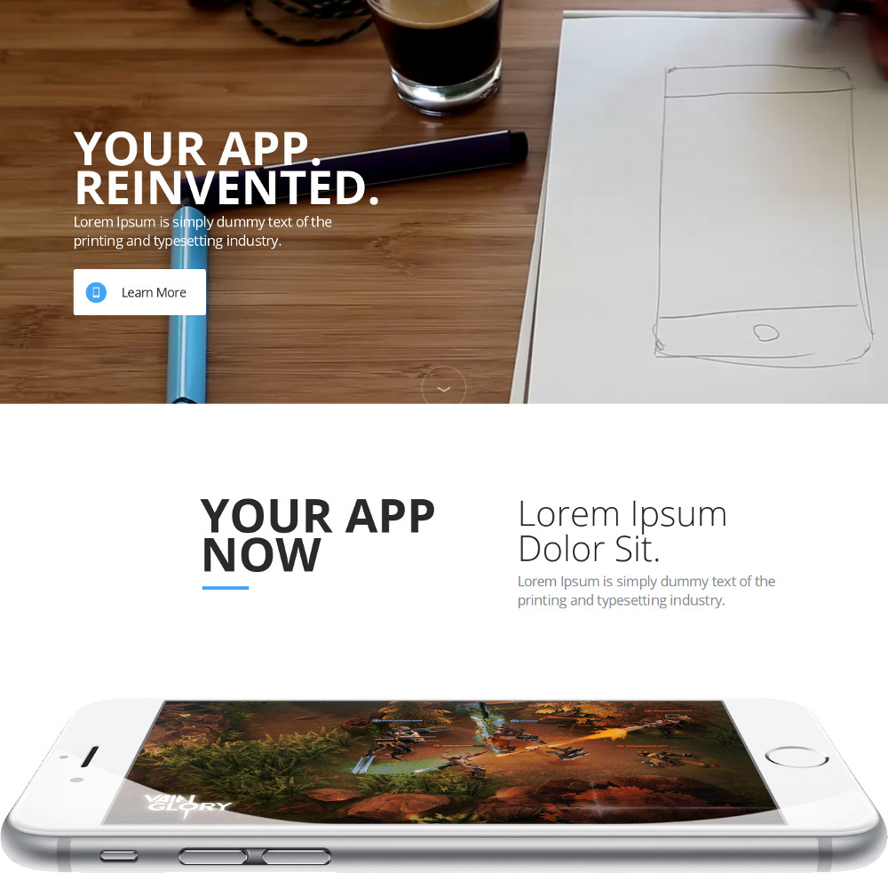
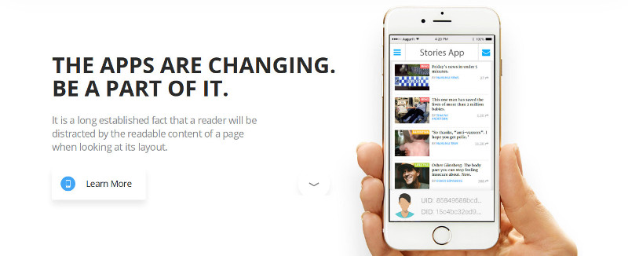
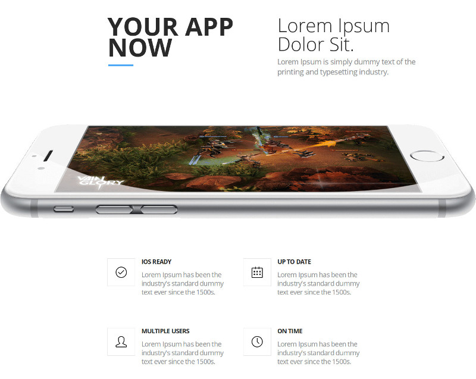
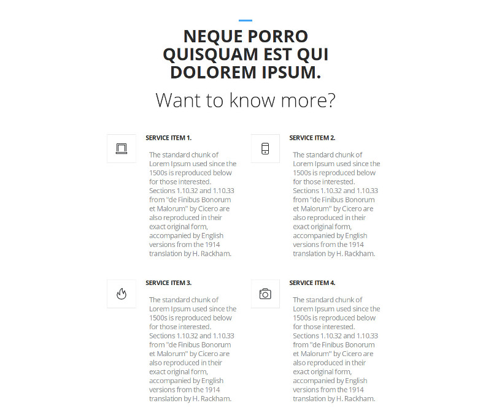
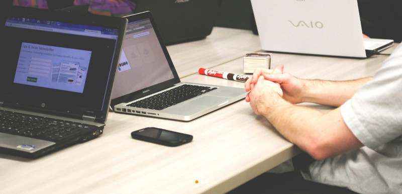

# Appi theme for Grav CMS

Appi theme is a port of [Appi](http://blacktie.co/2015/08/appi-app-landing-page/) by [Black Tie](http://blacktie.co/).

Appi Grav theme doesn't contain the same source code of the original HTML template of Black Tie because the package of Appi HTML template seems broken, it doesn't contains a modal JavaScript which is used to show video in a modal, so this feature is removed in Appi Grav theme, there are some changes in JavaScript and CSS to make the Grav theme work properly.

# Installation

## GPM Installation (Preferred)

The simplest way to install this theme is via the [Grav Package Manager (GPM)](http://learn.getgrav.org/advanced/grav-gpm) through your system's Terminal (also called the command line).  From the root of your Grav install type:

    bin/gpm install appi

This will install the Gateway theme into your `/user/themes` directory within Grav. Its files can be found under `/your/site/grav/user/themes/appi`.

## Manual Installation

To install this theme, just download the zip version of this repository and unzip it under `/your/site/grav/user/themes`. Then, rename the folder to `appi`.

You should now have all the theme files under

    /your/site/grav/user/themes/appi

>> NOTE: This theme is a modular component for Grav which requires the [Grav](http://github.com/getgrav/grav), [Error](https://github.com/getgrav/grav-theme-error), [Problems](https://github.com/getgrav/grav-plugin-problems), [Email](https://github.com/getgrav/grav-plugin-email) and [Form](https://github.com/getgrav/grav-plugin-form) plugins.

# Setup

If you want to set Appi as the default theme, you can do so by following these steps:

* Navigate to `/your/site/grav/user/config`.
* Open the **system.yaml** file.
* Change the `theme:` setting to `theme: appi`.
* Save your changes.
* Clear the Grav cache. The simplest way to do this is by going to the root Grav directory in Terminal and typing `bin/grav clear-cache`.

Once this is done, you should be able to see the new theme on the frontend. Keep in mind any customizations made to the previous theme will not be reflected as all of the theme and templating information is now being pulled from the **appi** folder.

# Configuration

If you have [Admin plugin](https://github.com/getgrav/grav-plugin-admin) installed, you can fully manage the sub-pages via Admin plugin.

Here is the list of available sub-pages in the theme.

## herohome

**herohome** creates a hero section with background video or background image. If background video is provided, background image is used as a fallback when background video can't be played or if we are on mobile devices. If only background video is not provided, background image is used instead.

This sub-page has heading, sub-heading and buttons.

## herocareers

**herocareers** has heading, sub-heading, buttons and a background image.

## headernavigation

This sub-page shows site name on the left side and a navigation on the right side. There is no settings required.

## details

**details** sub-page contains heading, sub-heading, image for desktop and mobile, list of details. The content of the page is shown below sub-heading.

## highlights

This sub-page contains heading, sub-heading, image, list of details. The content of the page is shown below sub-heading.

## quote

**quote** contains heading, name and image of the person who gave the quote. The quote is put in the content of the page.

## services

This sub-page contains heading, sub-heading, and a list of information.

## sliders

**sliders** sub-page automatically gets all the images in the page's folder and shows them as a slideshow. No configuration needed.

## subscription

**subscription** sub-page is used to collect visitor's phone number. It only contains a heading and a subscription form (Form plugin is required).

## footer

You can use **footer** sub-page to show copyright info. You just need to put what you want to show in the page's content. There is no special settings required.

## footernavigation

**footernavigation** shows a menu in the center of the page. There is no settings required.

# Updating

## GPM Update (Preferred)

The simplest way to update this theme is via the [Grav Package Manager (GPM)](http://learn.getgrav.org/advanced/grav-gpm). You can do this with this by navigating to the root directory of your Grav install using your system's Terminal (also called command line) and typing the following:

    bin/gpm update appi

This command will check your Grav install to see if your Gateway theme is due for an update. If a newer release is found, you will be asked whether or not you wish to update. To continue, type `y` and hit enter. The theme will automatically update and clear Grav's cache.

## Manual Update

Manually updating Appi is pretty simple. Here is what you will need to do to get this done:

* Delete the `your/site/user/themes/appi` directory.
* Download the new version of the Appi theme from this repository.
* Unzip the zip file in `your/site/user/themes` and rename the resulting folder to `appi`.
* Clear the Grav cache. The simplest way to do this is by going to the root Grav directory in terminal and typing `bin/grav clear-cache`.

> Note: Any changes you have made to any of the files listed under this directory will also be removed and replaced by the new set. Any files located elsewhere (for example a YAML settings file placed in `user/config/themes`) will remain intact.
